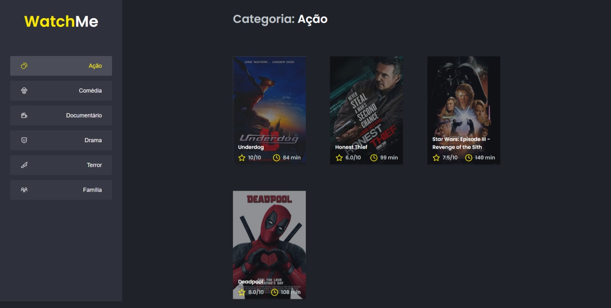

<h1 align="center">Watchme</h1>

<h3>✔ Status do projeto</h3>
<h4>Projeto em construção... 🧱</h4>

### ✔ Features

- [x] - Componente Context
- [x] - Componente SideBar

<h3>✔ Demostração da aplicação</h3>
<h1 align="center">
  
</h1>

<h3>✔ Pré-requisitos e como rodar a aplicação</h3>

Antes de começar você precisa ter instalado em sua maquina o NodeJS (https://nodejs.org/en/) e o Git (https://git-scm.com/).
Para facilitar o desenvolvimento É interessante possuir um editor de código como o VSCode (https://code.visualstudio.com/).

### Rodando a aplicação

#### Abre o seu terminal e rode o comando abaixo

$ git clone https://github.com/lagalvao/watchme-ignite.git

#### Em seguida entre na pasta do projeto

$ cd watchme-ignite

#### Depois rode o comando abaixo para instalar as dependências

$ npm install

#### Por fim execute a aplicação no modo de desenvolvimento

$ npm run dev

#### Abra uma nova aba, e rode o comando abaixo para a api fake funcionar

$ npm run server

### ✔  Tecnologias utilizadas

- [React] (https://pt-br.reactjs.org/)
- [Typescript] (https://www.typescriptlang.org/)
- [Webpack] (https://webpack.js.org/)
- [Babel] (https://babeljs.io/)
- [Sass] (https://sass-lang.com/)
